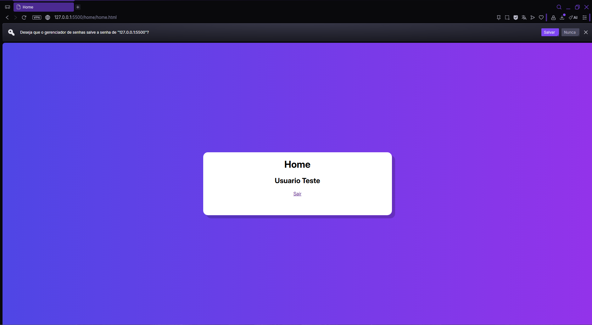
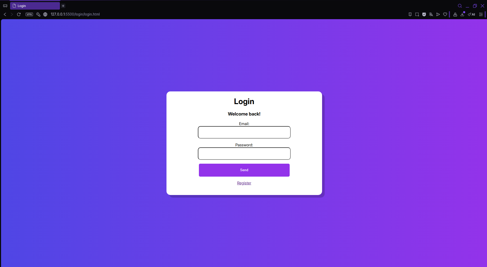
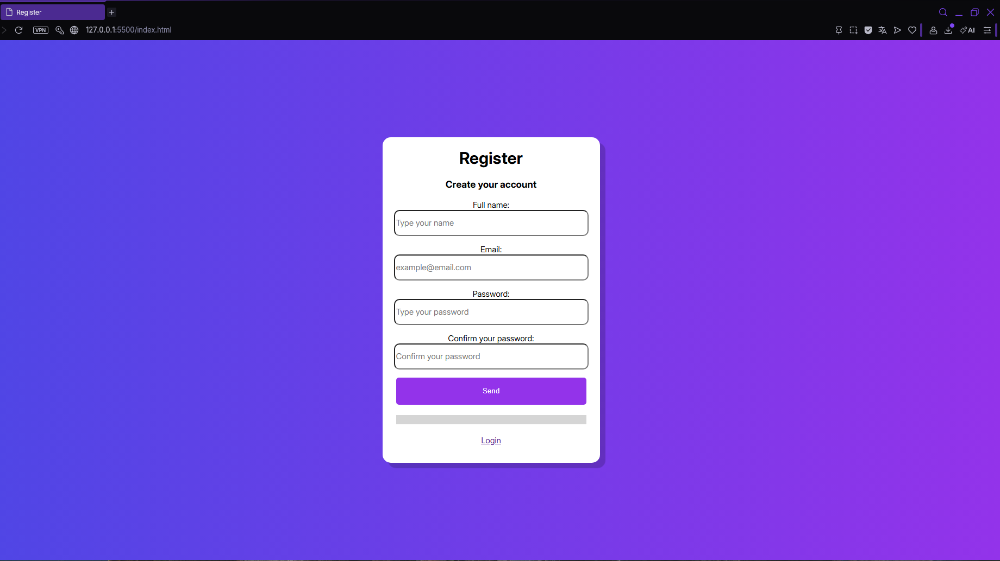

# 🔐 Sistema de Cadastro e Login com JavaScript

Este é um projeto simples de **sistema de autenticação (cadastro e
login)** feito apenas com **HTML, CSS e JavaScript puro**, utilizando o
**LocalStorage** do navegador como armazenamento de dados.

O objetivo do projeto é estudar:

-   Manipulação do DOM
-   LocalStorage
-   Módulos JavaScript
-   Redirecionamento entre páginas
-   Lógica de autenticação básica

------------------------------------------------------------------------

# 🚀 Funcionalidades

✅ Cadastro de usuário\
✅ Barra de progresso no formulário de cadastro\
✅ Login com validação de email e senha\
✅ Armazenamento de usuários no LocalStorage\
✅ Redirecionamento para página Home\
✅ Exibição do nome do usuário logado

------------------------------------------------------------------------

# 📁 Estrutura do Projeto

    /project-root
    │
    ├── index.html
    ├── script.html
    ├── style.css
    ├── /home
    │   └── home.html
    |   └── home.js
    |   └── homeStyle.css
    │
    ├── /login
    |   └── login.html
    |   └── login.js
    |   └── loginStyle.css
    ├── /class
    │   └── user.js
    │
    │
    └── README.md

------------------------------------------------------------------------

# 🧠 Como Funciona

## 📌 Cadastro

1.  Usuário preenche:
    -   Nome
    -   Email
    -   Senha
    -   Confirmação de senha
2.  Sistema:
    -   Valida se as senhas coincidem
    -   Gera um ID único (`crypto.randomUUID()`)
    -   Salva no LocalStorage:

```{=html}
<!-- -->
```
    user_<id>

Exemplo:

``` json
{
  "id": "uuid",
  "name": "Juan",
  "email": "juan@email.com",
  "password": "123"
}
```

------------------------------------------------------------------------

## Screenshots



------------------------------------------------------------------------
## 📌 Login

1.  Usuário digita email e senha\
2.  Sistema percorre o LocalStorage\
3.  Compara os dados\
4.  Se bater:
    -   Login realizado
    -   Redireciona para:

```{=html}
<!-- -->
```
    home.html?id=<id_do_usuario>

------------------------------------------------------------------------

## 📌 Home

1.  Pega o `id` da URL\
2.  Busca no LocalStorage\
3.  Exibe o nome do usuário

------------------------------------------------------------------------

# 💾 Tecnologias Utilizadas

-   HTML5
-   CSS3
-   JavaScript (ES6+)
-   LocalStorage API

------------------------------------------------------------------------

# ▶️ Como Rodar

## Opção 1

Abrir `index.html` no navegador.

## Opção 2 (recomendado)

Usar Live Server no VS Code.

------------------------------------------------------------------------

# ⚠️ Aviso de Segurança

Projeto educacional.

❌ Senhas não criptografadas\
❌ LocalStorage não é seguro para produção\
❌ Sem backend real

-----------------------------------------------

# 👨‍💻 Autor

Projeto para estudos de JavaScript.

------------------------------------------------------------------------

# ⭐ Licença

Livre para estudo e modificação.
